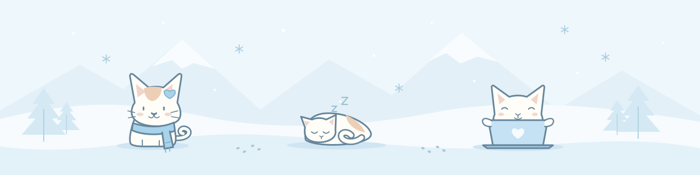

  

  <samp>a little corner for code &amp; curiosity.</samp>

### A Little Company

<picture>
  <source media="(max-width: 600px) and (prefers-reduced-motion: reduce) and (prefers-color-scheme: dark)" srcset="./assets/cat-dark-mobile-static.svg" />
  <source media="(max-width: 600px) and (prefers-reduced-motion: reduce)" srcset="./assets/cat-light-mobile-static.svg" />
  <source media="(prefers-reduced-motion: reduce) and (prefers-color-scheme: dark)" srcset="./assets/cat-dark-static.svg" />
  <source media="(prefers-reduced-motion: reduce)" srcset="./assets/cat-light-static.svg" />
  <source media="(max-width: 600px) and (prefers-color-scheme: dark)" srcset="./assets/cat-dark-mobile.svg" />
  <source media="(max-width: 600px)" srcset="./assets/cat-light-mobile.svg" />
  <source media="(prefers-color-scheme: dark)" srcset="./assets/cat-dark.svg" />
  
</picture>

a few commits, a little curiosity, and a cat keeping company.

 

  

<a href="./CREDITS.md">Made with a little help from open source</a>

